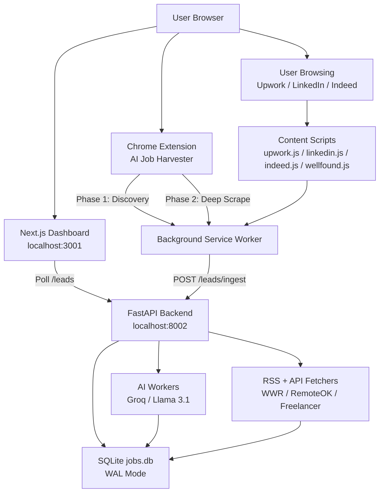

# 🤖 Job Monitor V3 — Complete Blueprint & Knowledge Base

> **Purpose**: Full technical and functional knowledge base for AI review, extension, and improvement of the system's AI capabilities.

---

## 1. System Overview

**Job Monitor V3** is a 3-layer SaaS tool that harvests job leads from multiple platforms, classifies them using AI, and provides an intelligent command center to generate proposals and execution plans — all tailored to distinct agency personas or an individual freelancer persona.

**The Problem It Solves**: Freelance agencies waste hours manually scanning Upwork, LinkedIn, Indeed, and RSS boards to find leads that match their capabilities. This system automates discovery, scoring, and bid preparation.

---

## 2. Architecture



### Layers
| Layer | Technology | Port | Role |
|---|---|---|---|
| **Backend** | Python / FastAPI + Uvicorn | 8002 | API, AI workers, DB, fetchers |
| **Frontend** | Next.js 14 (TypeScript) | 3001 | Dashboard UI |
| **Extension** | Chrome MV3 Service Worker | N/A | Active scraping harvester |

---

## 3. Agency Personas (The Core Business Context)

The system's entire AI classification is based on routing jobs to one of these 5 agency personas:

| Key | Name | Focus | Pitch Angle |
|---|---|---|---|
| `ascend` | **Ascend Growth Studio** | D2C & Growth Marketing | "We install a growth OS to scale from $1M to $10M" |
| `apex` | **Apex Partners** | Fractional C-Suite & Strategy | "Senior-level strategic guidance without full-time cost" |
| `socketlogic` | **SocketLogic Labs** | Technical Automation & Engineering | "We build the automation backbone that lets you scale without headcount" |
| `theshield` | **The Shield** | Legal & Compliance | "Bulletproof legal foundations" |
| `infrastructure` | **SecurOps Solution** | Cybersecurity & IT Infrastructure | "Enterprise-grade security for growing businesses" |

### Agency Keywords (Classifier Training)
Each persona has a rich keyword list used as pre-filter and AI hint:
- **Ascend**: `marketing, growth, ads, seo, shopify, d2c, klaviyo, ugc, creative, lead gen...`
- **Apex**: `executive, fractional, cfo, coo, board, strategy, m&a, private equity, scaling...`
- **SocketLogic**: `python, javascript, api, automation, ai, llm, zapier, n8n, devops, scraping...`
- **TheShield**: `legal, gdpr, compliance, nda, contracts, hr, regulatory, audit...`

### Reject Keywords
Jobs containing these are auto-rejected: `babysitter, nanny, data entry, virtual assistant, transcription, intern, unpaid, volunteer`

---

## 4. Database Schema (SQLite — WAL Mode)

### Table: `job_leads`
| Column | Type | Description |
|---|---|---|
| `id` | TEXT PK | `{source}_{external_id}` (max 50 chars) |
| `source` | TEXT | Origin platform (e.g., "We Work Remotely - Marketing") |
| `external_id` | TEXT | Original platform ID |
| `title` | TEXT | Job title |
| `description` | TEXT | Full job description |
| `url` | TEXT | Direct link to job |
| `budget` | TEXT | Budget string (e.g., "Hourly: $30-$50") |
| `company` | TEXT | Extracted company name |
| `posted_at` | TEXT | ISO timestamp |
| `agency_match` | TEXT | Classified agency key (ascend/apex/socketlogic/...) |
| `match_score` | REAL | AI fit score 0–100 |
| `ai_confidence` | REAL | Classifier confidence 0.0–1.0 |
| `match_reasoning` | TEXT | Free-text explanation from AI |
| `status` | TEXT | Default: `'new'` |
| `applied` | INTEGER | 0 or 1 flag |
| `applied_at` | TEXT | ISO timestamp of application |
| `applied_by` | TEXT | User who applied |
| `connect_score` | INTEGER | Computed Upwork "Connect Score" (0–70) |
| `client_signals` | TEXT | JSON blob: payment_verified, client_spent, hire_rate, proposal_count |
| `created_at` | TEXT | Row creation timestamp |

### Table: `job_sources`
| Column | Description |
|---|---|
| `id` | Unique source key |
| `name` | Display name |
| `type` | `'rss'` or `'api'` |
| `url` | Feed/API endpoint |
| `parsing_config` | JSON mapping of response keys |
| `enabled` | 0 or 1 |
| `last_checked` | ISO timestamp |

### Table: `system_metrics`
| Column | Description |
|---|---|
| `metric_type` | Metric name |
| `value` | Numeric value |
| `timestamp` | ISO timestamp |

### Table: `contacts`
Stores extracted decision-maker contacts: `id, name, role, location, url, email_guess, validation_status, source, created_at`

---

## 5. Backend — File-by-File Reference

### `main.py` — FastAPI Application Entry
- **Lifespan**: `init_db()` → `seed_sources()` → starts `worker()` + `ai_analysis_worker()` background tasks
- **CORS**: Wildcard (`*`) allowed for local dev

#### API Endpoints
| Method | Path | Description |
|---|---|---|
| `GET` | `/` | Health ping |
| `GET` | `/system/health` | Queue depth, throughput, status |
| `GET` | `/leads` | Get all `status='new'` leads, sorted by `match_score DESC` |
| `GET` | `/leads/refresh` | Triggers RSS/API fetchers (streaming text response) |
| `GET` | `/leads/export-csv` | Download applied leads as CSV |
| `POST` | `/leads/ingest` | Batch ingest from Extension (queued) |
| `POST` | `/leads/enrich` | Update `client_signals` + recalculate `connect_score` |
| `POST` | `/leads/{id}/update-status` | Mark lead as applied |
| `POST` | `/leads/{id}/unapply` | Unmark applied lead |
| `POST` | `/generate-proposal` | AI-written cover letter (Groq) |
| `POST` | `/generate-action-plan` | AI execution plan (Groq) |
| `POST` | `/analyze-company` | Extract company name, industry, decision makers |

#### Background Workers
- **`worker()`**: Pulls from `job_queue` (asyncio.Queue), saves leads via `fetchers.save_lead()`
- **`ai_analysis_worker()`**: Polls DB for unscored leads (`match_score = 0`), calls `classify_with_ai()`, updates score/confidence

#### Connect Score Logic (Enrichment)
```
payment_verified → +15 pts
client_spent > $10,000 → +20 pts
hire_rate > 50% → +15 pts
proposal_count < 5 → +20 pts (low competition)
Max possible: 70 pts
```

### `config.py` — Agency Configuration Hub
- Defines all 5 agency personas (name, focus, strengths, pitch, target_roles, industries, services)
- `AGENCY_KEYWORDS` dict for pre-filtering
- `REJECT_KEYWORDS` for spam exclusion
- `DB_PATH`: `backend/data/jobs.db`

### `database.py` — Thread-Safe SQLite Manager
- **WAL mode** enabled for concurrent reads
- `DB_WRITE_LOCK` = threading.Lock() — serializes all writes at Python level
- `get_read_connection()` — context manager, no lock needed
- `get_write_connection()` — context manager, acquires lock, auto-commit/rollback

### `fetchers.py` — Data Ingestion Engine

#### Pre-filter: `should_reject_job(text)`
Checks against `REJECT_KEYWORDS` before any AI processing.

#### `classify_with_ai(title, description)` — Core AI Classifier
1. Pre-filter via `should_reject_job()`
2. Builds dynamic prompt from `AGENCY_CONTEXT` using `build_ai_prompt()`
3. Calls Groq `llama-3.1-8b-instant` with `response_format={"type": "json_object"}`
4. Returns `(agency_key, confidence, score)` tuple
5. Retries once on HTTP 429

#### `UniversalRssFetcher` — RSS Feed Parser
- Uses `feedparser` library
- Extracts: id, title, summary, link, company (from "Company: Title" or "Title at Company" patterns)

#### `UniversalApiFetcher` — JSON API Parser
- Generic mapper using `parsing_config` JSON rules from DB
- Maps: `id_key, title_key, desc_key, url_key, company_key`

#### `run_all_fetchers()` — Orchestrator
- Loads enabled sources from DB
- Instantiates correct fetcher class per source type
- Yields progress events: `progress:N:msg`, `log:msg`, `error:msg`, `done:N`

#### Default Data Sources (seeded on startup)
| ID | Name | Type | URL |
|---|---|---|---|
| `wwr_marketing` | We Work Remotely - Marketing | RSS | weworkremotely.com/categories/remote-sales-and-marketing-jobs.rss |
| `wwr_design` | We Work Remotely - Design | RSS | weworkremotely.com/categories/remote-design-jobs.rss |
| `freelancer_api` | Freelancer.com (Python/Marketing) | API | freelancer.com API |
| `remoteok` | RemoteOK (Python) | API | remoteok.com/api |

### `ai_client.py` — Groq Client Factory
- Loads `GROQ_API_KEY` from `.env`
- Exposes singleton `get_groq_client()` → returns `Groq` instance or `None`

### `discord_notify.py` — Alert System
- Sends rich Discord embed for new leads
- Color coding: `ascend=Blue`, `apex=Amber`, `others=Emerald`
- Fields: title, description snippet, agency match, source, AI score

---

## 6. AI Prompt Engineering (Current Implementation)

### Classification Prompt (`build_ai_prompt`)
```
Classify this job into ONE of the following business units:
ASCEND (Ascend Growth Studio):
  - Focus: D2C & Growth Marketing
  - Keywords: E-commerce, DTC Brands, Health & Wellness...
  - Roles: CMO, VP Marketing, Head of Growth...

[...repeat for each agency...]

If the job does not clearly fit ANY, return REJECT.

JOB TITLE: {title}
JOB DESC: {description[:800]}

Return formatted JSON ONLY:
{
  "agency": "AGENCY_KEY" (or "reject"),
  "confidence": 0.0 to 1.0,
  "reasoning": "Short explanation",
  "score": 0 to 100
}
```

### Proposal Generation Prompt
```text
(Dynamically switches between "I" (Individual) and "We" (Agency) based on user toggle)

STRICT OUTPUT RULES:
- Output ONLY the proposal text itself. Start directly with the first sentence.
- Do NOT summarize or paraphrase the job posting.
- Hook: Open with a bold, original insight, not a cliché.
- Value: 3-5 action-oriented bullet points (What I will DO, not just what I know).
- Tone: Warm, confident, direct. 250-350 words max.
- Banned phrases: 'well-oiled machine', 'synergy', 'exponential growth'.
```

### Action Plan Prompt (Sections)
1. **Job Analysis** — What the client is actually looking for (nuances, hidden requirements)
2. **Difficulty & Risks** — Technical complexity (Low/Med/High) and red flags
3. **Action Plan** — Detailed 3–5 step execution plan
4. **Time Estimation** — Realistic hours/days
5. **Budget Strategy** — Suggested fixed price or hourly rate
6. **Strategic Suggestions** — Upsell opportunities, tools, client impression tips

### Company Analysis Prompt
```
Extract the company name, industry, and likely decision maker roles.
Return JSON: {company_name, industry, targets (list of roles)}
Job: {description[:1000]}
```

**Model used for all**: `llama-3.1-8b-instant` (Groq)
**Temperature**: 0.1 (classification), default (proposals/plans)
**Max tokens**: 150 (classification), unlimited (proposals)

---

## 7. Chrome Extension Architecture

### `manifest.json` — Permissions
- `tabs, storage, alarms, activeTab, scripting, notifications`
- Host permissions: Upwork, LinkedIn, Wellfound, Indeed, localhost:8002

### Content Scripts
| File | Triggers On |
|---|---|
| `upwork.js` | `*.upwork.com/*` |
| `linkedin.js` | `linkedin.com/*` |
| `indeed.js` | `indeed.com/jobs*` |
| `wellfound.js` | `wellfound.com/jobs*` |
| `dashboard-bridge.js` | `localhost:3001/*` |

### Background: `service-worker.js` — 2-Phase Harvesting

#### Phase 1: Discovery
1. Build search URLs per platform per keyword
2. Open up to 5 tabs concurrently (`MAX_TABS_PHASE_1`)
3. Wait 12 seconds for page to load
4. Send `harvestLinks` message to content script
5. Collect unique job URLs → push to `linkQueue`
6. Close tabs, process next batch

#### Phase 2: Deep Scrape
1. Open up to 5 job detail page tabs
2. Wait 12 seconds
3. Send `harvestPage` message → get full job object
4. POST to `/leads/ingest`
5. Track progress stats: `discovered, processed, totalToProcess`

#### Progress Broadcasting
- Broadcasts progress object to all open dashboard tabs via `chrome.tabs.sendMessage`
- Dashboard receives via `window.addEventListener('message', ...)`
- Payload: `{isMonitoring, phase, discovered, processed, totalToProcess, eta}`

#### Scheduling
- Uses `chrome.alarms` API to schedule recurring harvest cycles
- Default interval: 15 minutes (configurable in popup)

---

## 8. Frontend Dashboard — `page.tsx`

### State Management (React useState)
| State | Description |
|---|---|
| `leads` | Full list of job leads from API |
| `filter` | Agency filter: `all, ascend, apex, socketlogic, applied` |
| `sourceFilter` | Filter by job source |
| `sortMode` | `'smart' \| 'recency' \| 'score'` |
| `selectedLead` | Currently open lead in side panel |
| `aiProposal` | Generated proposal text (Markdown) |
| `aiPlan` | Generated action plan text (Markdown) |
| `proposalPersona` | `'agency' \| 'individual'` toggle for proposal voice |
| `companyAnalysis` | `{company_name, industry, targets}` |
| `enhancedDescription` | User-edited context to augment AI prompts |
| `extProgress` | Extension harvest progress tracker |
| `isManual` | Manual input mode toggle |
| `systemHealth` | Backend health metrics |

### Smart Sort Algorithm
```
Tier 3 (score ≥ 90) → shown first
Tier 2 (score ≥ 70) → shown second
Tier 1 (score < 70) → shown last
Within same tier → sort by recency (newest first)
```

### Key Features
- **Stats Grid**: Clickable counters for All/Ascend/Apex/SocketLogic/Applied — act as filter buttons
- **Source Filters**: Horizontal scroll pills showing count per source
- **System Health Modal**: Queue depth, throughput, avg AI time, recommendation text
- **Extension Progress**: Phase 1 (Discovery) and Phase 2 (Deep Scrape) progress bars with ETA and STOP button
- **Manual Input Mode**: Opens blank proposal panel to generate plans without a harvested lead
- **Enhanced Description**: Free-text field to add context before AI generation
- **Apply Confirmation Modal**: Forces agency classification confirmation before marking applied
- **CSV Export**: Downloads applied leads as CSV file

---

## 9. Current Bugs & Code Quality Issues

| Issue | Location | Severity |
|---|---|---|
| `classify_with_ai()` called **twice** in succession | `main.py:269` | Medium — doubles Groq API cost |
| `@app.post("/leads/enrich")` decorator is **duplicated** | `main.py:286-287` | Low — FastAPI ignores duplicate, but confusing |
| `conn.close()` called **after** context manager already closes connection | `main.py:187` | Medium — potential double-close error |
| `useEffect` cleanup function **defined twice** | `page.tsx:210-217` | Low — second return overrides first (memory leak risk) |
| `DISCORD_WEBHOOK_URL` is **hardcoded** in `config.py` | `config.py:6` | High — secret exposed in version control |
| `should_reject_job()` in `fetchers.py` has **body replaced with comment** | `fetchers.py:17-19` | Critical — rejection filter is non-functional |
| `ai_analysis_worker` has **no rate limiting** for AI calls | `main.py:255-282` | Medium — could burn Groq tokens if backlog is large |
| `connect_score` max is 70, but code implies 0-100 scale | `main.py:291-303` | Low — misleading scoring range |

---

## 10. Proposed AI Capability Improvements

This section outlines recommended enhancements to elevate the AI layer from "basic classification" to a **full strategic intelligence system**.

### 10.1 Multi-Model Routing
**Currently**: All tasks use `llama-3.1-8b-instant` (fast, but limited reasoning)

**Proposed**: Route by task complexity
```python
MODELS = {
    "classify": "llama-3.1-8b-instant",      # Fast, cheap
    "proposal": "llama-3.3-70b-versatile",   # High quality writing
    "plan": "llama-3.3-70b-versatile",       # Deep reasoning
    "company": "llama-3.1-8b-instant",       # Structured extraction
}
```

### 10.2 Enhanced Proposal System
**New prompt additions**:
- Include agency's `sample_services` in proposal context
- Include `pitch_angle` as writing angle instruction
- Add `client_signals` data (budget, hire rate) to tailor tone
- Add `connect_score` to decide urgency level of pitch

**New endpoint**: `POST /proposals/{id}/rate` — Let users rate proposal quality (1-5 stars) to build a fine-tuning dataset.

### 10.3 Client Behavior Prediction
**New AI feature**: Given `client_signals`, predict likelihood of getting hired.

```python
@app.post("/predict-win-rate")
def predict_win_rate(req: AIRequest):
    """Predict probability of winning this job based on signals."""
    prompt = f"""
    Analyze these client signals and predict win probability:
    - Budget: {req.budget}
    - Payment Verified: {signals.payment_verified}
    - Client Spend History: ${signals.client_spent}
    - Hire Rate: {signals.hire_rate}%
    - Competing Proposals: {signals.proposal_count}
    - AI Match Score: {req.score}/100
    
    Return JSON: {{"win_probability": 0.0-1.0, "reasoning": "...", "optimal_bid": "..."}}
    """
```

### 10.4 Competitive Intelligence
**New endpoint**: `POST /analyze-market`
- Takes job description → returns market rate analysis
- Identifies competing agencies based on job keywords
- Suggests differentiation strategy for the specific agency persona

### 10.5 Proposal Quality Scorer
Before showing a generated proposal to the user, run a second AI pass to score it:

```python
def score_proposal(proposal_text, job_description, agency_context):
    prompt = f"""
    Rate this proposal on:
    1. Relevance to job (1-10)
    2. Agency pitch clarity (1-10)
    3. Call to action strength (1-10)
    4. Professional tone (1-10)
    
    Proposal: {proposal_text}
    Job: {job_description}
    
    Return JSON: {{"scores": {...}, "total": X/40, "suggestions": ["..."]}}
    """
```

### 10.6 Smart Lead Clustering
**New feature**: Use embeddings to cluster similar jobs, deduplicate semantically similar leads (not just by ID), and surface "opportunity windows" when many leads in a category appear.

### 10.7 AI-Powered Rejection Explanation
When `classify_with_ai()` returns `"reject"`, currently nothing is shown.

**Improvement**: Store the reasoning, show it in UI so users can override with a click.

### 10.8 Feedback Loop / Memory
**New feature**: When a user marks a lead as "Applied" and later adds notes, feed this back to improve future classification. Build a `job_feedback` table:

```sql
CREATE TABLE job_feedback (
    id TEXT PRIMARY KEY,
    job_id TEXT,
    was_correct_match BOOLEAN,
    actual_agency TEXT,
    outcome TEXT,  -- 'won', 'lost', 'no_response'
    notes TEXT,
    created_at TEXT
);
```

---

## 11. Technology Dependencies

### Backend (`requirements.txt`)
| Package | Version | Purpose |
|---|---|---|
| `fastapi` | ≥0.104.0 | Web framework |
| `uvicorn` | ≥0.24.0 | ASGI server |
| `pydantic` | ≥2.0.0 | Data validation |
| `requests` | ≥2.31.0 | HTTP client for fetchers |
| `feedparser` | ≥6.0.10 | RSS parsing |
| `python-dotenv` | ≥1.0.0 | Env variable loading |
| `groq` | ≥0.4.0 | Groq AI API client |
| `apscheduler` | ≥3.10.4 | (Listed but not actively used — background workers use asyncio) |

### Frontend (`package.json` dependencies)
- `next` 14.x
- `react` 18.x
- `react-markdown` — Renders AI-generated markdown in UI
- TypeScript

### Extension
- Chrome Manifest V3
- Pure JavaScript (no bundler)
- `chrome.storage`, `chrome.alarms`, `chrome.tabs`, `chrome.scripting`, `chrome.notifications` APIs

---

## 12. Environment Variables

| Variable | Location | Description |
|---|---|---|
| `GROQ_API_KEY` | `backend/.env` | Groq API authentication key |

> ⚠️ **Security Issue**: `DISCORD_WEBHOOK_URL` is hardcoded in `config.py` — must be moved to `.env`.

---

## 13. Startup & Ports

```bash
# Backend (fastapi + uvicorn)
cd backend && python main.py
# → Runs on http://localhost:8002

# Frontend (Next.js dev server)
cd frontend && npm run dev
# → Runs on http://localhost:3001

# Extension
# chrome://extensions → Developer Mode → Load Unpacked → select /extension folder
```

---

## 14. Data Flow (End-to-End)

```
[Platform] → [Content Script] → [Service Worker] → POST /leads/ingest
                                                         ↓
                                               [job_queue (asyncio)]
                                                         ↓
                                               [worker() coroutine]
                                                         ↓
                                               [fetchers.save_lead()]
                                                         ↓
                                               [SQLite: match_score=0]
                                                         ↓
                                          [ai_analysis_worker() polls]
                                                         ↓
                                          [classify_with_ai() → Groq]
                                                         ↓
                                          [UPDATE job_leads SET score/agency]
                                                         ↓
                                          [Dashboard polls GET /leads]
                                                         ↓
                                          [User opens lead → POST /generate-proposal]
                                                         ↓
                                          [Groq → Rendered Markdown → User]
```

---

## 15. Key Design Decisions & Trade-offs

| Decision | Rationale | Trade-off |
|---|---|---|
| SQLite with WAL mode | Simple deployment, no server needed | Not suitable for >100 concurrent users |
| Global write lock (Python threading.Lock) | Prevents SQLite "database is locked" errors | Sequential writes reduce throughput |
| `llama-3.1-8b-instant` for all | Speed, cost-efficiency on Groq free tier | Lower reasoning quality vs 70B models |
| 2-Phase extension harvesting | Separates link discovery from data extraction | 12s timeout per tab is a fixed delay |
| asyncio.Queue for ingest | Decouples scraping speed from AI speed | Lost on server restart (in-memory) |
| JSON parsing_config in job_sources table | Makes sources configurable without code changes | Schema changes require DB migrations |

---

*Blueprint generated: 2026-02-25 | Version: V3.0*
